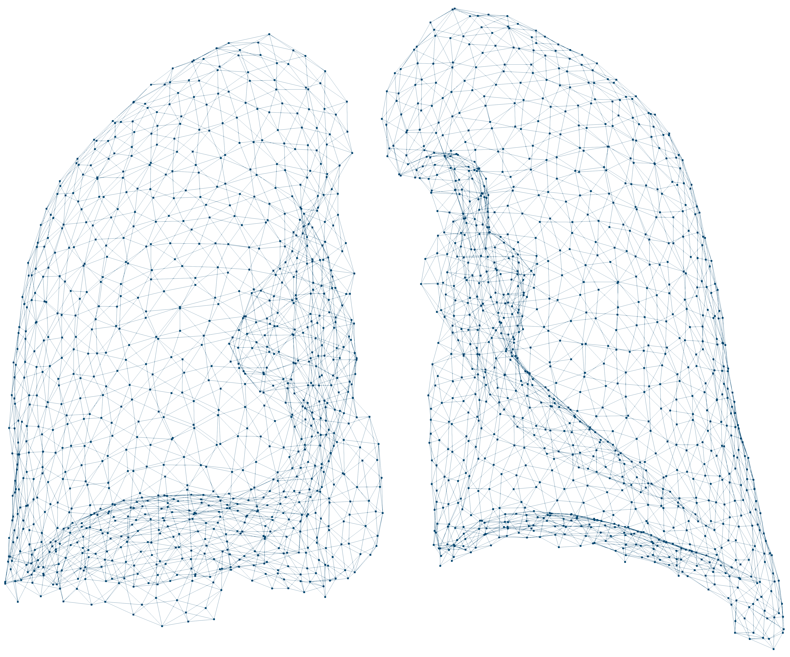

  

:::::{.page_contente}
:::{#hero-heading}

# Hello,

My name is Loïc Guezou. I am currently finishing up my <b>PhD in Computational Mechanics</b> under the supervision of Bing Tie and Andrea Barbarulo at LMPS (Laboratoire de Mécanique Paris-Saclay, a lab of Université Paris-Saclay, ENS Paris-Saclay, CentraleSupélec, CNRS). Estimated date of defense: mid-2026

In that framework, my main research interest lied in solving non-linear (hyperelastic) parametric problems using model order reduction techniques like the Proper Generalised Decomposition (PGD), for biomimetic applications (3D printing aneurysmal aortic models).

I am currently looking for a Postdoctoral position in order to explore further the fields of model reduction and/or biomechanics, as well as broadening my interests, notably in in the domains of AI (PINN, ML-ROM...) and uncertainty quantification.

:::: {style='margin-top: 1em;'}
::::

::: {.line}

:::

:::: {style='margin-top: 0em;'}
::::

:::: {.columns}

::: {.column width="15%"}

:::

::: {.column width="80%"}

<!-- {width="80%" style="display: block; margin: 0 auto;"}

:::: {style='margin-top: 3em;'}
:::: -->

<!-- <iframe width="100%" height="550" src="Resources/AR/3D_lung_AR.html"></IFRAME> -->

:::

::::

:::
:::::
