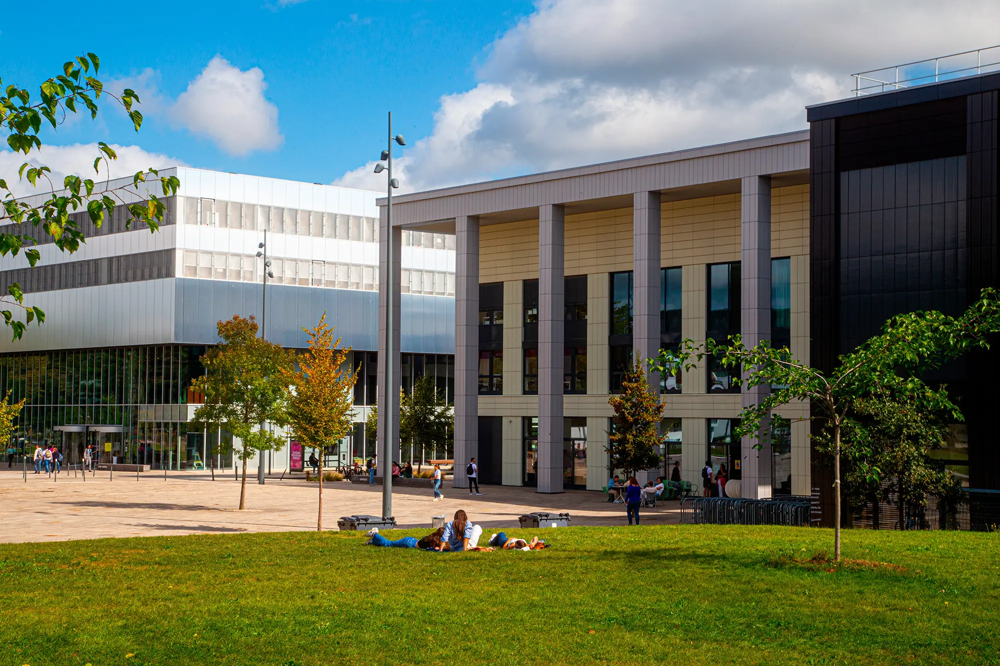
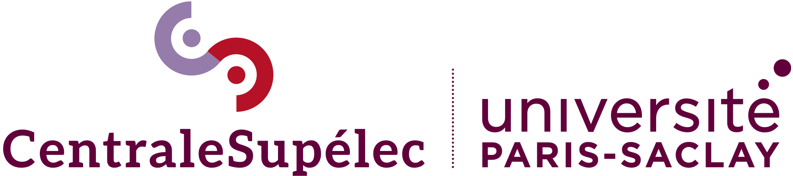
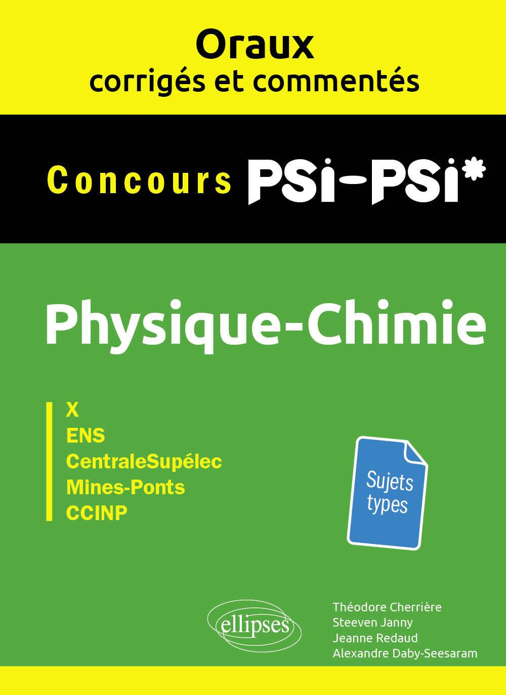
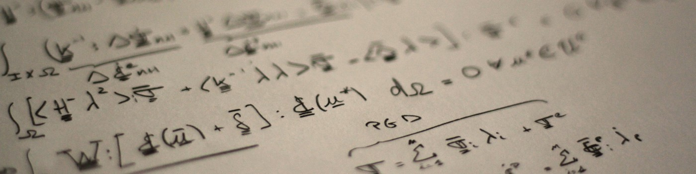

### Teaching in "Cycle ingénieur" at CentraleSupélec

:::: {.columns}

::: {.column width="50%"}
{width="70%" fig-align="center"}
:::

::: {.column width="50%"}

- **2022 - 2024** -- Project supervision
  - [Séquence Thématique](https://www.centralesupelec.fr/catalogue-de-formations/ingenieur-generaliste-2eme-annee): **Design for Additive Manufacturing** (ST7 - 81)
  - 2nd year students (equiv. 1st year of Master)
  - 20 hours per year

:::

::::

### Teaching Master students at Université Paris-Saclay (CentraleSupélec)

:::: {.columns}

::: {.column width="50%"}

- **2023 - 2025** -- Teaching assistant
  - Tutorial sessions in **computational structural dynamics**
  - Students from [Master 2 in Computational Mechanics](https://www.universite-paris-saclay.fr/formation/master/mecanique/m2-modelisation-et-simulation-en-mecanique-des-structures-et-systemes-couples)
  - 12 hours per year

:::

::: {.column width="50%"}

{width="80%" fig-align="right"}

:::

<!-- ::::

### Physique-chimie PSI-PSI* Concours X, ENS, CentraleSupélec, Mines-Ponts, CCINP

:::: {.columns}

::: {.column width="25%"}

{width="80%" fig-align="center"}

:::

::: {.column width="75%"}

:::: {style='margin-top: 5em;'}
::::

- Writing a **physics book** for undergraduate students (**Classes Préparatoires aux Grandes Écoles**)
- **Physics** problems, **corrections**, and **comments**, helping students prepare for their entrance exams to prestigious universities (French "Grandes Écoles").

:::

::::

### Advanced-level courses

:::: {.columns}

::: {.column width="50%"}

I designed notebooks about **dimensionnality reduction** in both linear and non-linear contexts. Those few short courses relevant to model reduction are available on my github

* [**Course 1**](https://alexandredabyseesaram.github.io/Non-linear_ROM/kPCA_v_SVD.html) Non-linear manifold learning: SVD and kernel PCA
* [**Course 2**](https://alexandredabyseesaram.github.io/SVD_Investigations/Autoencoder.html) Non-linear manifold learning: Autoencoders
* [**Course 3**](https://alexandredabyseesaram.github.io/Simplified_NeuROM_demos/) NN-FEM, simplified implementation of NeuROM [@daby-seesaramNeuROM2024a] in 1D to get started with solving PDEs in the HiDeNN framweork [@zhangHierarchicalDeeplearningNeural2021]

:::

::: {.column width="50%"}

{width="80%" fig-align="right"}

::: -->

::::
